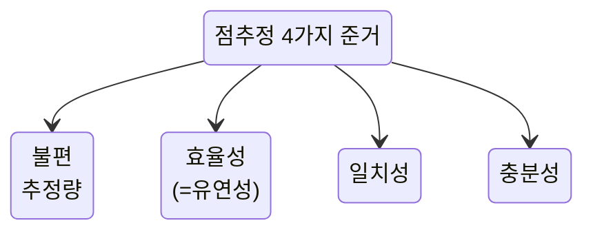

# 불편 추정량 (Unbiased Estimator)

## I. 모수와 가까워지려는 성질, 불편 추정량 개념
:::tip[통계적 개념]
표본으로부터 구한 통계량의 기대치가 추정하는 모수의 실제값과 같거나 가까워지려하는 성질
:::
:::tip[수학적 개념]
추정량 $\hat{\theta}$ 이 모수 ${\theta}$를 추정할 때, ${E[\hat\theta]=\theta}$ 가 성립하면 $\hat{\theta}$을 ${\theta}$의 불편 추정량이라고 부름
:::
-

## II. 불편 추정량 설명
<table>
  <colgroup>
    <col width={'300'} />
    <col width={'700'} />
  </colgroup>
  <thead>
  <tr>
    <th>구분</th>
    <th>상세 설명</th>
  </tr>
  </thead>
  <tbody>
  <tr>
    <th>hi</th>
    <td>
$$
S^{2} = \frac{1}{n - 1} \sum_{i=1}^{n} \bigl( X_i - \bar{X} \bigr)^{2}
$$
    </td>
  </tr>
  </tbody>
</table>

